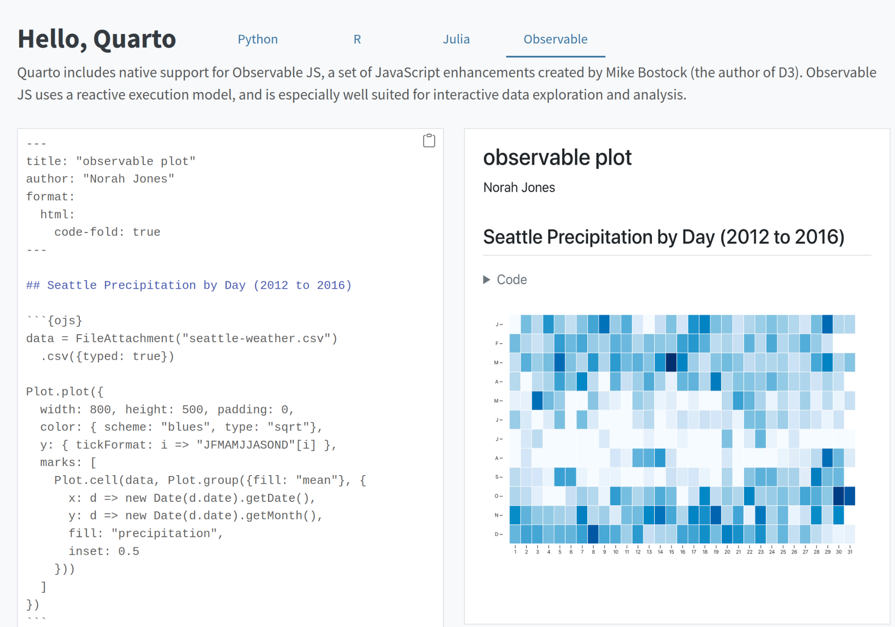

# Interactive Visualization of precipitation statistics on a year calendar

Prepared for the CalgaryR meetup of December 10, 2024. See https://www.meetup.com/calgaryr/events/303153331.

To visit the web page please go to https://padames.github.io/InteractiveVis/

## Purpose of the visualization

To illustrate how a multi-year daily time series can be mapped to a calendar to study the seasonal effects on the aggregate statistics of choice.
Mean, maximum, and minimum were offered to explore the behaviour of the data.

The interactivity is provided by chunks of Javascript code for the library observable JS. This feature was brought in about a year ago into the POSIT RStudio ecosystem and is based on the same company that built the industry-tested D3 Javascript library, https://observablehq.com/.

The original example this was based on appeared in https://quarto.org/ under the observable tab.

It was expanded with free data downloaded from the NOAA website https://www.ncdc.noaa.gov/cdo-web/search. The data transformations are included in the code shown in the page.

## How the static web page was created

The page is created from a second git branch off main. I called it `interactive-pages`.

This R project contains the file Quarto file `FromStaticToInteractive.qmd` used to render the corresponding `html` asset with the RStudio IDE.
To use the GitHub git-pages feature, the `html` file was copied and renamed `index.html` at the top of the project path.
